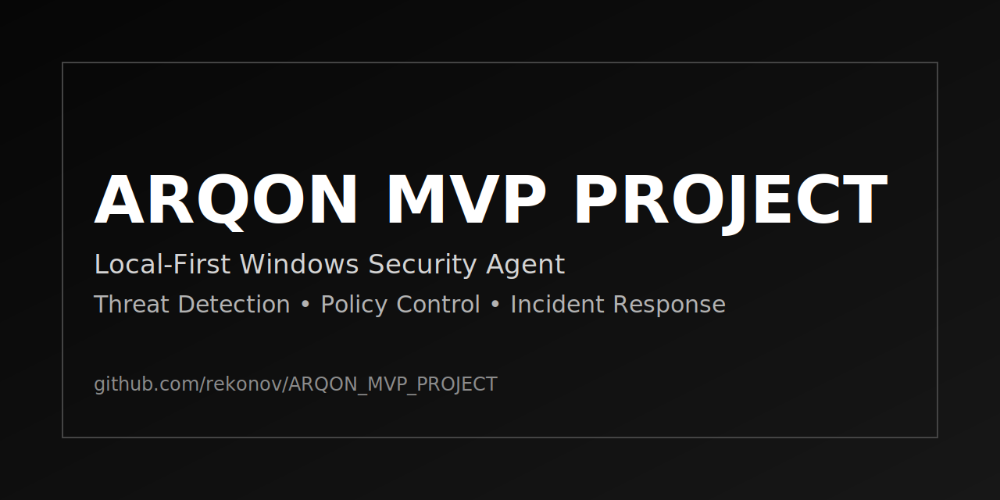

# ARQON MVP PROJECT



[](#)
[](#)
[](#)

## Overview

ARQON is a local-first Windows security agent focused on endpoint visibility, risk evaluation, and controlled operational automation.

Implemented capabilities include:
- Real-time process/download monitoring
- File and URL risk scoring
- Archive and script behavior heuristics
- Local API and dashboard for operations
- Signed policy packs with anti-replay checks
- Watchdog and self-healing runtime behavior
- Incident export and diagnostics bundle generation

## Scope Boundaries

- Not a kernel-level antivirus
- No HTTPS interception / MITM
- No VPN module at current stage

## Quick Start

```powershell
python -m venv .venv
.venv\Scripts\Activate.ps1
pip install -r requirements.txt
pip install -r requirements-dev.txt
pip install -e .

arqon-agent --config config/default.yml run
```

Dashboard:
- `http://127.0.0.1:8765/dashboard/`

## Repository Layout

- `src/arqon_guardian/` - core runtime modules
- `config/` - runtime and policy configuration
- `dashboard/` - local web dashboard assets
- `browser-extension/chromium/` - browser-side integration
- `scripts/` - setup, mode switching, build and maintenance helpers
- `tests/` - automated tests

## Status

- Stage: MVP
- Focus: hardening, UX consistency, and operational reliability

## License

MIT
